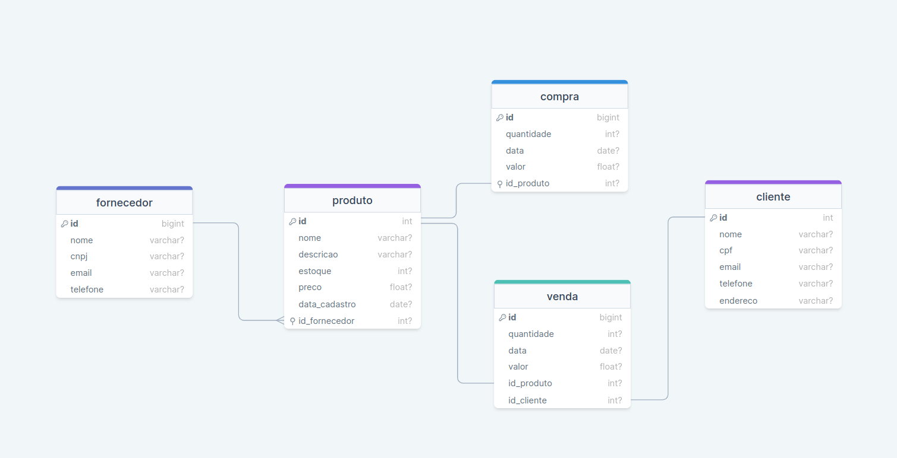

# <h1 id="top" align="center">Desapega da **TI** - Controle de Estoque API</h1>

  <a href="#sobre">Sobre</a> &#xa0; | &#xa0;
  <a href="#gear-features">Features</a> &#xa0; | &#xa0;
  <a href="#-tecnologias">Tecnologias</a> &#xa0; | &#xa0;
  <a href="#-requisitos">Requisitos</a> &#xa0; | &#xa0;

 

##  _**O que desenvolvemos neste Projeto?**_

📌 Desapega da TI é um trabalho acadêmico no qual desenvolvemos um sistema de gerenciamento de produtos e estoque. Uma aplicação de ponta a ponta com front-end utilizando **Java Swing GUI Builder**, back-end utilizando **Java POO** e banco de dados **MySQL**.

Desenvolvemos o projeto utilizando alguns princípios do **SOLID**, com módulos separados para facilitar a escalabilidade e a manutenção da nossa aplicação.

## :gear: Features

:heavy_check_mark: Cadastro de produto\
:heavy_check_mark: Deletar produto\
:heavy_check_mark: Editar produto\
:heavy_check_mark: Listar produtos\
:heavy_check_mark: Pesquisar produtos pelo nome\
:heavy_check_mark: Pesquisar produto pelo ID

## 👨‍💻 Tecnologias

As seguintes ferramentas foram usadas neste projeto:

- [JAVA](https://docs.oracle.com/en/java/)
- [MySQL](https://dev.mysql.com/doc/)

## :books: Bibliotecas

_**As seguintes bibliotecas foram utilizadas neste projeto:**_

- [Swing GUI Builder](https://docs.oracle.com/javase/tutorial/uiswing/index.html)

## 📝 Requisitos

- [Git](https://git-scm.com)
- [JDK](https://www.oracle.com/br/java/technologies/downloads/)
- [Netbeans](https://netbeans.apache.org/front/main/index.html)

## Diagram

💡 Diagrama de Entidades e Relacionamentos(DER) para evoluir o projeto.

  

<a href="#top">🔝 Back to top</a>
